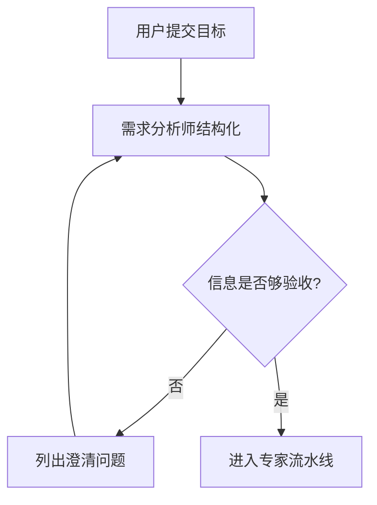

# Apex AI Guild — 通用 AI 技能团队

> 结构对齐《多智能体协同》常见模式：**Orchestrator + Workers** 中央编排  
> 实现 **标准化通信**、**串行专家流水线**（可扩展为并行 DAG）、**批评-审查者**与**合规门**

**现实边界**：没有系统能「自动完成世界上所有项目」。本 Skill 的目标是把角色、流程与验收说清楚，让你在 Cursor / 自建服务里**稳定地**组织多智能体协作，而不是夸大能力。

---

## 系统架构设计

### 协作模式

| 模式 | 用途 |
|------|------|
| **中央编排** | 统一任务拆解、顺序、质量门 |
| **专家流水线** | 每位专家消费「用户原始目标 + 前序产出」 |
| **批评-审查者** | 专门角色做交叉挑错，减少幻觉与遗漏 |
| **合规门** | 安全、隐私、版权与政策红线扫描（输出为风险提示，非法律意见） |

### 核心通信机制（A2A 消息壳）

与参考 Skill 相同思想，JSON 形状如下（实现见 `packages/multi-agent/src/a2a.ts` 的 `createTaskEnvelope`）：

```json
{
  "header": {
    "sender": "agent_id",
    "receiver": "agent_id",
    "task_id": "T-YYYYMMDD-XXX",
    "timestamp": "ISO-8601",
    "priority": "high|medium|low"
  },
  "body": {
    "task_type": "任务类型",
    "requirements": "具体需求",
    "deadline": "交付时间（可选）",
    "dependencies": ["前置任务ID"]
  },
  "context": {
    "project_id": "项目标识",
    "status": "pending|in_progress|completed|rejected",
    "previous_communications": ["历史消息ID"]
  }
}
```

### 冲突解决（三级）

1. **规则引擎**：安全/合规优先；硬性约束覆盖创意偏好。  
2. **协商**：多方案时用评分表（风险、成本、可验证性）比对。  
3. **仲裁**：由 **L1 协调者**（`orchestrator`）做最终取舍并写进交付包。

---

## 组织架构与角色

### BDI 摘要

| 角色类型 | 信念 | 愿望 | 意图 |
|----------|------|------|------|
| 协调者 | 掌握目标、约束与专家产出 | 可验收的交付 | 合并、裁决、对齐用户 |
| 架构/提示词 | 懂方法与边界 | 可复用的高质量模板 | 标准化、可测 |
| 领域专家 | 对单一职能负责 | 职能内最优 | 按清单输出 |
| 审查者 | 假设「初稿有错」 | 拦截重大遗漏 | 列问题与优先级 |

### 智能体档案（与代码中 `SKILL_TEAM_PIPELINE` 一致）

| 层级 | 角色 ID | 职责 |
|------|---------|------|
| L3 | `discovery-analyst` | 目标、非目标、约束、待澄清、风险 |
| L3 | `systems-architect` | 模块、数据流、里程碑、技术权衡 |
| L2 | `prompt-architect` | 提示范式选型、模板、评估标准 |
| L3 | `engineer` | 可执行实施计划与验收步骤 |
| L3 | `qa-guardian` | 测试策略、边界用例、回归点 |
| L3 | `risk-compliance` | 合规与红线扫描（标注需人工确认项） |
| L3 | `delivery-editor` | 用户可读交付结构（Markdown） |
| L4 | `reviewer-board` | 交叉评审：矛盾、遗漏、过度承诺 |
| L1 | `orchestrator` | 最终交付包：摘要、决议、行动项、未决问题 |

---

## 标准工作流

### 1. 任务接收（协调者逻辑）



### 2. 专家流水线（当前实现：串行）

顺序固定为：

`discovery-analyst` → `systems-architect` → `prompt-architect` → `engineer` → `qa-guardian` → `risk-compliance` → `delivery-editor` → `reviewer-board` → `orchestrator`

> 扩展：无依赖的专家（如「竞品扫描」与「架构草图」）可改为并行，再在 `delivery-editor` 前合并；需在编排层维护 DAG。

### 3. 质量门（Critic-Reviewer）

```
初稿链路 → 交付编辑整理 → 质量委员会挑错 → 合规扫描 → 协调者终审 → 交付用户
```

**审查清单（最低限度）**

- 需求对齐度（是否答非所问）  
- 逻辑一致性与可验证性  
- 风险与「未知/待确认」是否显式写出  
- 安全与隐私（密钥、PII、日志）  
- 是否过度承诺「已完成」但未验证的工作  

---

## 项目交付物（通用软件/产品项目）

| # | 交付物 | 负责角色 |
|---|--------|----------|
| 1 | 需求与成功标准 | discovery-analyst |
| 2 | 架构与里程碑 | systems-architect |
| 3 | 提示词/AI 工作流规范 | prompt-architect |
| 4 | 实施计划与验收 | engineer |
| 5 | 测试与质量策略 | qa-guardian |
| 6 | 合规与风险表 | risk-compliance |
| 7 | 用户可读总文档 | delivery-editor |
| 8 | 评审问题单 | reviewer-board |
| 9 | 协调者最终包 | orchestrator |

---

## 代码中如何运行

构建并执行（九角色，**9 次 LLM 调用**，成本较高）：

```bash
npm run build -w multi-agent
npm run multi-agent:skill -- "用 Next.js 做一个带登录的待办应用，SQLite，部署到单台 VPS"
```

或：

```bash
node packages/multi-agent/dist/cli.js --skill "你的项目描述"
```

环境变量见仓库根目录 `.env.example` 中 `MULTI_AGENT_*`。

---

## 使用方式（对「张总」说话 — 协调者人设）

用户可对协调者说：

- 「张总：这是项目背景与约束，输出完整交付包。」  
- 「张总：评审上一轮方案，列出 P0 问题并给修订顺序。」  
- 「张总：只做架构 + 实施计划，跳过合规长文。」（需在编排层做「子流水线」配置，当前 CLI 为全量九步。）

专家直调（高级）：在 Cursor 里 @ 某个角色，并粘贴 `packages/multi-agent/src/skillTeam/prompts.ts` 中对应 system 片段作为系统提示。

---

## 与「萌娃小剧场」Skill 的关系

- **相同骨架**：中央编排、A2A 消息壳、多级冲突处理、BDI 表、审查者、交付清单。  
- **不同领域**：本 Skill 面向**通用项目交付**（软件、产品、运维、文档），角色从「剧本/视觉」替换为「架构/工程/QA/合规」。  
- **实现位置**：TypeScript 包 `multi-agent`；萌娃领域可复制本文件改角色表与 prompts 即可。

---

## 升级清单（自检）

1. 中央编排与固定流水线（可扩展 DAG）  
2. 标准化 A2A 类型与工厂函数  
3. 专家串行协作 + 上下文累积  
4. 质量委员会 + 合规角色  
5. 协调者终审与交付包语义  

**完成后**，团队在 **`packages/multi-agent`（你的应用后端 / CLI）** 协作；人类协作仍用 Issue/PR/IM，AI 协作由编排器与 Bus 统一调度。
